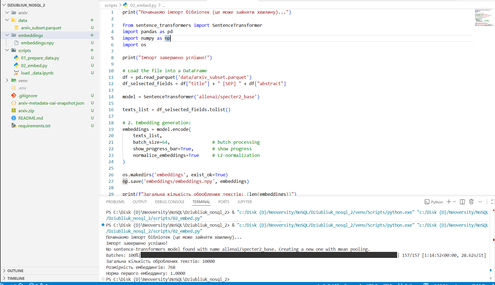
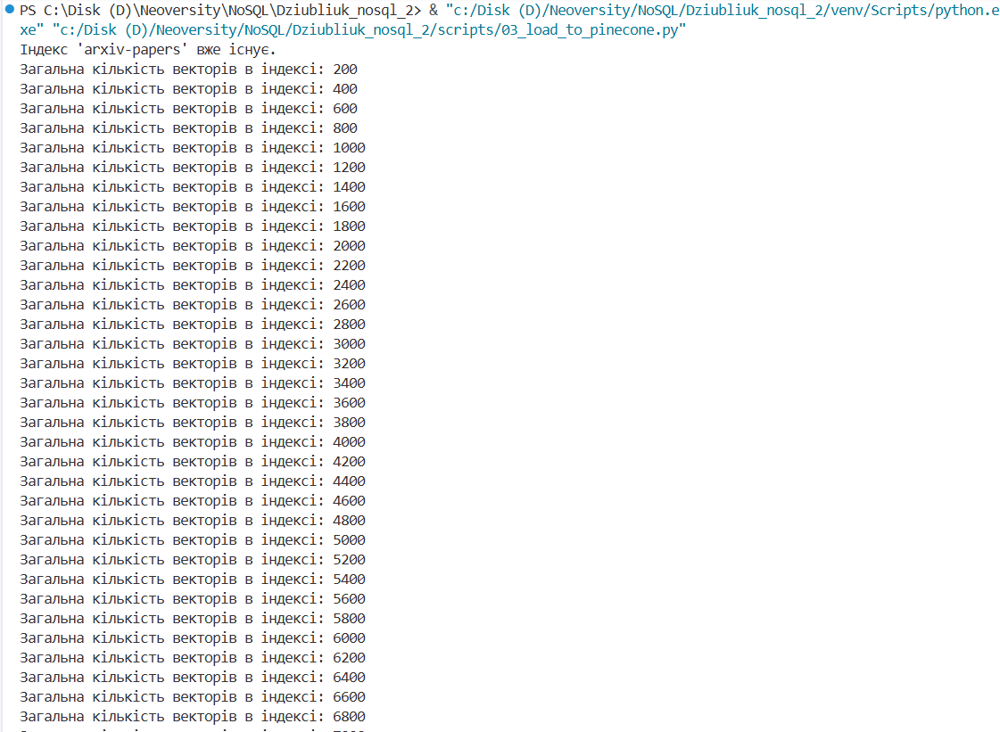
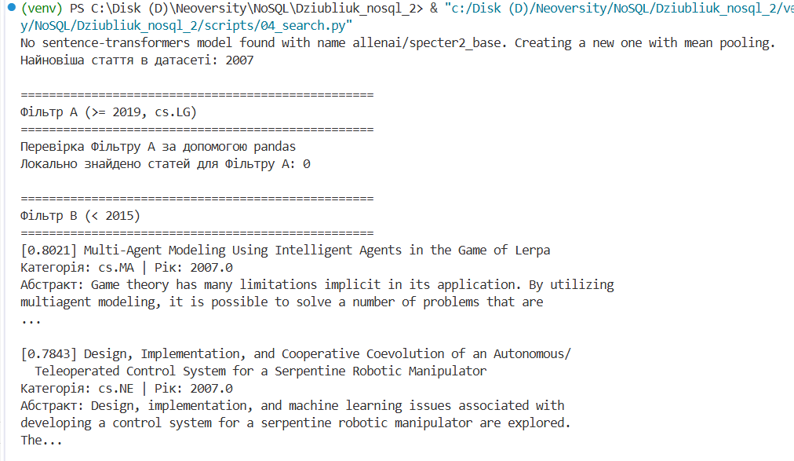
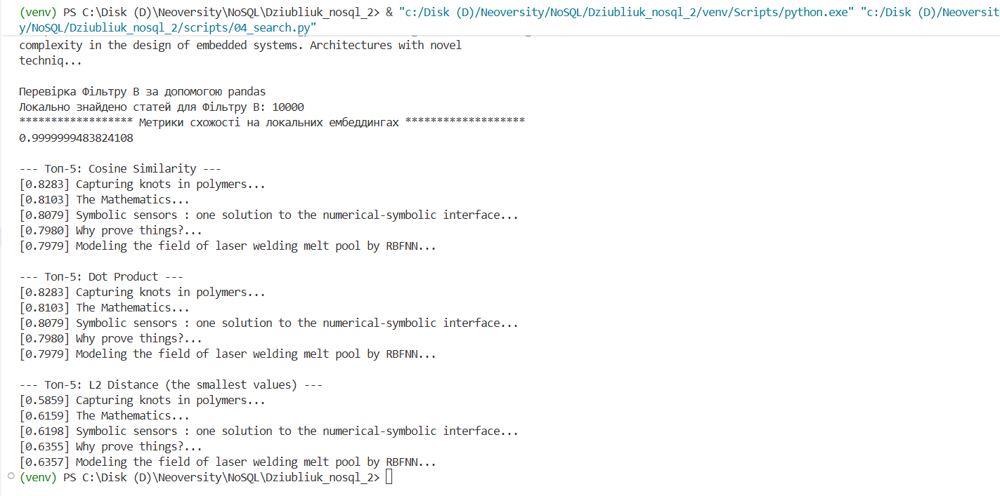
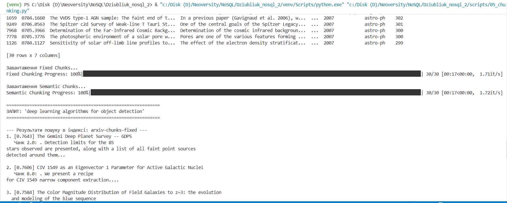
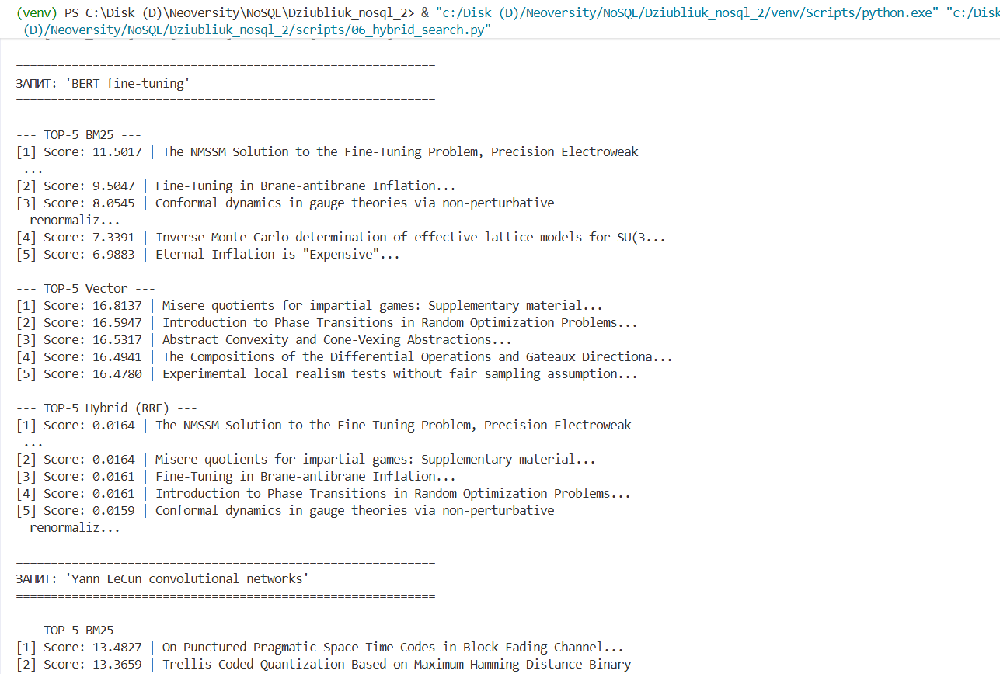
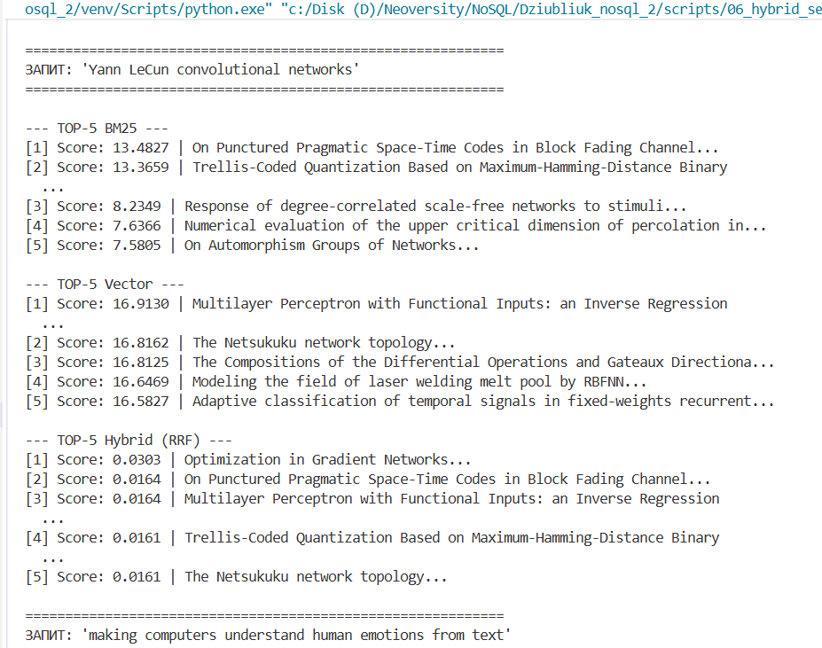
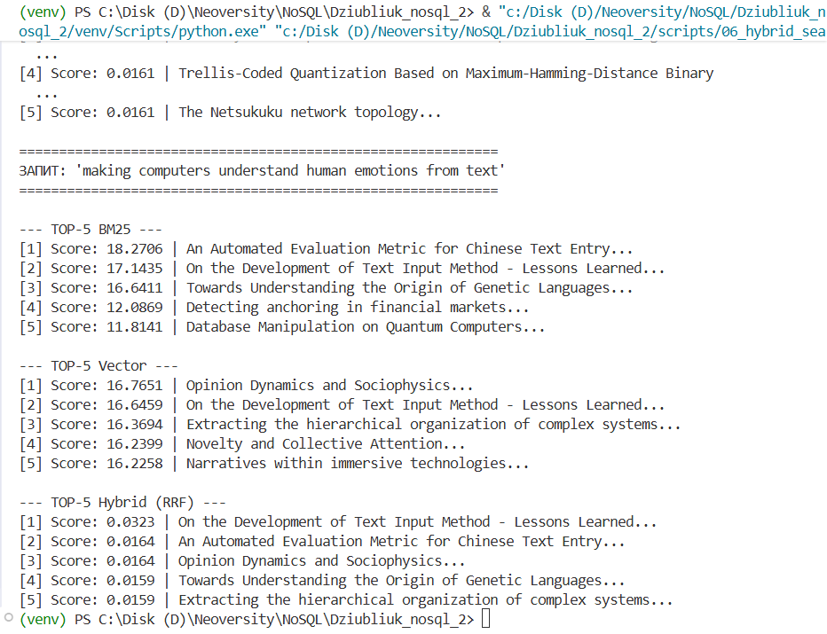

# Вимоги до оточення
* Python (версії __3.9__ або вище)
* Зареєструватися на [pinecone.io](https://www.pinecone.io/).
* Створити API-ключ у розділі API Keys на сайті і зберегти його у файл .env у корені проєкту (файл не комітити — додайте в .gitignore):
```
PINECONE_API_KEY=your-api-key-here
```

# Налаштування середовища та встановлення залежностей
* Створення віртуального середовища Python: 
```
python -m venv .venv
```
* Активація віртуального середовища: 
```
.\.venv\Scripts\Activate.ps1 (Windows)

source .venv/bin/activate (Linux)
```
* Встановити необхідні бібліотеки: 
```
pip install -r requirements.txt
```

# Порядок запуску скриптів
Усі скрипти знаходяться в папці __scripts/__ і мають запускатися в чіткій послідовності:
1. Завантаження "сирих" даних python __scripts/01_load_data.py__. Python-скрипт читає дані з CSV-файлу та завантажує їх у колекцію tracks_raw.
```
python scripts/01_load_data.py
```
2. Трансформація та очищення даних відбувається в файлі __02_transform.js__. Цей скрипт обробляє колекцію __tracks_raw__, створює вкладені об'єкти та зберігає готовий результат у фінальну колекцію __tracks__.
Запуск файлу:
```
mongosh "ваша_строка_підключення_до_MongoDB з .env файлу" --file scripts/02_transform.js
```

# Структура репозиторію:

# Відповіді на питання
# Частина 1

**1. Чим Pinecone відрізняється від Qdrant і Chroma за моделлю розгортання, ліцензією і продуктивністю? У якому сценарії ви б обрали кожен із них?**

**Відповідь:** За моделлю розгортання Pinecone працює виключно як хмарний сервіс (SaaS). Натомість Chroma та Qdrant можна запустити локально на своєму комп'ютері чи розгорнути в докері. Обидва є open-source продуктами, що дозволяє безкоштовно використовувати їх у будь-яких проектах, модифікувати код і не платити за ліцензію. Такого не скажеш про Pinecone, оскільки він є комерційним продуктом з закритим кодом, з тарифами на доступність серверів. Щодо продуктивності, Pinecone добре справляється з горизонтальним масштабуванням і здатен автоматично оптимізувати індекси. Проте швидкість пошуку може знижуватися, якщо запит містить складну фільтрацію за текстовими метаданими. На відміну від Pinecone, Chroma виконує пошук миттєво на невеликих об'ємах, проте
він не розрахований на гігантські навантаження більше 10 мільйонів векторів. Лідером за співвідношенням ціна/продуктивність вважається Chroma, оскільки він обробляє пошук із жорсткими мета-фільтрами в рази швидше за конкурентів, споживаючи мінімум оперативної пам'яті. 
Pinecone я б обрала у випадку, якщо в мене невеликий проект, і я не хочу думати про налаштування серверів, оновлення баз даних, бекапи.
Якщо мені необхідно протестити швидко свої дані або розробляю десктопний додаток, який повинен працювати автономно, має сенс використати Chroma.
Якщо мені потрібна максимальна швидкість, маю мільйонні обсяги даних або в мене жорсткі правила безпеки даних (заборонено передавати дані у сторонні хмари), а також хочу заощадити гроші на масштабі, то я оберу Qdrant.

**2. Чому для задачі пошуку по науковим текстам обрана модель specter2_base, а не універсальна all-MiniLM-L6-v2? Знайдіть картку моделі на HuggingFace і процитуйте, для яких задач вона навчена.**

**Відповідь:** Модель all-MiniLM-L6-v2 є універсальною (general-purpose), навчена на побутових текстах: розмовах, статтях з Вікіпедії, новинах, відгуках та інш. Але вона не розуміє наукову термінологію. Крім того, у науці подібність між двома статтями визначається не лише схожими словами в анотації, а й тим, на які праці вони посилаються. Універсальна модель all-MiniLM-L6 цього не розуміє. Модель specter2_base навчалася на наукових статтях (більш ніж 6 мільйонів триплетів цитат наукових статей). Дана модель розрахована на такі основні формати задач: classification, regression, proximity (пошук найближчих сусідів, рекомендація схожих статей), adhoc search (пошук за сирими короткими текстовими запитами користувачів). Саме тому модель specter2_base обрали для задачі пошуку по наукових текстах.

**3. Що написано у картці моделі про рекомендовану метрику схожості? Чому це важливо при створенні індексу?**

**Відповідь:** В офіційній документації вказано, що модель specter2_base оптимізовану під косинусну подібність як основну метрику оцінки близькості векторів у просторі. При створенні нового векторного індекса обов'язково необхідно вказати один з трьох типів метрик: cosine, dot_product або euclidean. Модель specter2_base розроблялася з розрахунком на те, що схожі статті матимуть гострий кут між векторами, а ми будемо змушувати Pinecone шукати документи за довжиною кроку між точками в просторі (euclidean), математика пошуку зламається. Довжина наукових анотацій та заголовків різна. Довша стаття згенерує вектор із більшими значеннями координат. Через це Евклідова відстань між двома довгими статтями на однакову тематику може виявитися величезною через кількість слів. Косинусна подібність ігнорує довжину векторів і дивиться тільки на кут між ними. В цьому і полягає важливість того, що треба вказувати коректну метрику схожості. Тому основним правилом роботи з векторними моделями - це завжди перевіряти картку моделі на HuggingFace. Створення індексу в базі даних має дублювати ту метрику, за допомогою якої автори тренували нейромережу. Для specter2_base це є косинусна подібність. 

**4. Поясніть, чому при використанні нормалізованих ембеддингів (одиничної довжини) косинусна схожість (cosine similarity) еквівалентна скалярному добутку (dot product)?**

**Відповідь:** Нормалізація - це процес, коли вектор масштабують так, щоб його довжина дорівнювала 1. Формула косинусної схожісті має вигляд:
$\text{Cosine Similarity}(\vec{u}, \vec{v}) = \frac{\vec{u} \cdot \vec{v}}{\|\vec{u}\| \cdot \|\vec{v}\|}$, 
$\vec{u} \cdot \vec{v}$ - це скалярний добуток (dot product),
$\|\vec{u}\|$ та $\|\vec{v}\|$ — це геометричні довжини цих векторів.
Коли ми нормалізуємо вектор його $\|\vec{u}\|$ та $\|\vec{v}\|$ стають рівними 1. Тоді косинусна подібність буде дорівнювати скалярному добутку:
$\text{Cosine Similarity}(\vec{u}, \vec{v}) = \vec{u} \cdot \vec{v}$

Без нормалізації векторів комп'ютеру доводиться рахувати скалярний добуток, потім довжини векторів, і потім вже виконувати ділення. Операції ділення важкі для процесора. Але коли дані нормалізовані, не потрібно нічого ділити чи рахувати корені, просто перемножуються числа та їхнє додавання ($u_1v_1 + u_2v_2 + \dots$). Таким чином, для нормалізованих векторів косинусна схожість дорівнює скалярному добутку. Тому для нормалізованих моделей доцільніше обирати метрику dot_product, оскільки вона дає той самий результат, що й cosine, але працює значно швидше.


# Частина 2


# Частина 3

**1. Чи збігаються топ-5 для cosine і dot product і чому?**

**Відповідь:** Так, вони будуть ідентичними. Причина в тому, що під час генерації ембеддингів ми використали normalize_embeddings=True (L2-нормалізація). Це означає, що довжина кожного вектора дорівнює 1. Коли довжина векторів дорівнює 1, знаменник у формулі косинусної подібності (A · B) / (||A|| * ||B||) стає рівним одиниці (1 * 1 = 1). Тому формула спрощується до звичайного скалярного добутку (A · B).

**2. Чи відрізняються результати для L2 і чому?**

**Відповідь:** Топ-5 документів для cosine, dot product і L2 однаковий (ті самі статті в тому ж порядку), але значення (scores) будуть іншими. Косинусна схожість і скалярний добуток вимірюють "кут" між векторами (від -1 до 1, чим ближче до 1, тим краще). Евклідова відстань (L2) вимірює фізичну "відстань" між кінцями векторів у просторі (від 0 і більше, чим менше, тим краще). Оскільки вектори нормалізовані, найближчі точки (L2) також матимуть найменший кут між собою.

**3. Що сталося б, якби ембеддинги не були нормалізовані?**

**Відповідь:** Якби вектори мали різну довжину, топ-5 для Dot Product і Cosine Similarity відрізнявся б. Dot Product "штрафував" би короткі вектори і надавав перевагу дуже довгим векторам, навіть якщо вони вказують у трохи іншому напрямку. Cosine Similarity ігнорував би довжину і дивився тільки на напрямок.

Під час виконання пошуку з фільтрацією виявлено, що для фільтру А (статті за останні 5 років, категорія cs.LG) результат є порожнім. Аналіз датасету arxiv_subset.parquet показав, що найновіша стаття 2007 ріку. Таким чином, датасет не містить сучасних статей за умовами фільтру А. Натомість для фільтру В (статті до 2015 року) пошук успішно відпрацював, оскільки весь масив даних відповідає цій умові.




# Частина 4

**1. Яка стратегія дає більш осмислені чанки?**

**Відповідь:** Більш осмисленою є стратегія Semantic chunking, оскільки вона розбиває текст за смисловими межами. Речення об'єднуються до тих пір, поки їх ембеддинги залишаються схожими. Коли зміст тексту різко змінюється, створюється новий chunk. Такий метод дозволяє зберігати контекст при обробці великих текстів і забезпечує більш точний аналіз інформації.

**2. Чи є випадки розрізаних речень і як це впливає на ембеддинги?**

**Відповідь:** У Fixed-size chunking розрізання речень трапляється постійно, оскільки алгоритм рахує кількість слів. Таким чином, початок речення може потрапити в один чанк, а його кінець (який містить головний висновок) — в інший. Коли модель намагається перетворити такий чанк у вектор, вона губиться в контексті. Ембеддинг виходить розмитим, і такий чанк може випадати з результатів пошуку.

**3. Як розмір overlap впливає на кількість чанків і покриття тексту?**

**Відповідь:** Overlap це кількість слів, що дублюються наприкінці попереднього чанка і на початку наступного. Чим більший overlap, тим повільніше ми рухатися по тексту, і кількість чанків збільшується. Таким чином, потрібно виділити більше пам'яті в базі даних Pinecone і більше часу на створення ембеддингів. Overlap добре підходить для Fixed-size chunking: якщо важливе словосполучення було розрізане на межі 50-го слова, overlap у 10 слів гарантує, що у наступному чанку це словосполучення опиниться цілим.



# Частина 5

**1. Який метод дав кращий результат і чому?**

**Відповідь:** У даному експерименті Гібридний метод (RRF) дав найбільш збалансований та адекватний результат, хоча якість вибірки обмежена невеликим розміром індексованого корпусу та специфікою векторної моделі specter2_base. BM25 занадто буквально шукає слова. Для запиту "BERT fine-tuning" він вивів фізичні статті про Fine-Tuning, проігнорувавши контекст BERT. Векторний пошук видав випадкові статті з високим математичним скором, оскільки короткі текстові запити погано мапилися на векторний простір наукових абстрактів specter2_base. Гібридний пошук відсіяв крайнощі. Наприклад, для запиту про емоції ("making computers understand human emotions from text"), гібрид вивів на 1-е місце статтю "On the Development of Text Input Method - Lessons Learned...", яка фігурувала в топах обох алгоритмів (2-е місце у Vector, 2-е місце в BM25).

**2. Чи є документи в топ-5 гібридного пошуку, яких немає в топ-5 окремих методів, і чому?**

**Відповідь:** Так, є. Наприклад, запит "Yann LeCun convolutional networks". На 1-му місці в гідридному пошуку опинилася стаття "Optimization in Gradient Networks...", якої взагалі немає в ТОП-5 ні у BM25, ні у Vector. Можливо це відбулося через те, що ця стаття займала відносно високі позиції в списках для BM25 та Vector пошуків. Окремо вона не потрапила у п'ятірки лідерів. Але завдяки сумуванню ранків від обох систем, його сукупний RRF-скор виявився вищим, ніж у статей, що були на першому місці.

**3. Як зміна параметра k в RRF впливає на видачу (наприклад, k=60 vs k=1)?**

**Відповідь:** Параметр k є регулятором "штрафу" за низьку позицію в рейтингу. При k=60 знаменник має велике значення. Різниця між 1-м місцем (1/(60+1) = ~0.01639) та 5-м місцем (1/(60+5) = ~0.01538) незначна. Це згладжує оцінки і дозволяє документам, які стабільно тримаються в середині обох списків (як-от "Optimization in Gradient Networks..."), обходити різкі поодинокі піки.При k=1 різниця між 1-м та 5-м місцем буде різко відрізнятися: 1/(1+1) = ~0.5, 1/(1+5) = ~0.166. При такому значенні k алгоритм майже повністю ігноруватиме документи з нижніх позицій.





# Частина 6
**1. Семантичний пошук vs BM25. Наведіть конкретні приклади запитів із вашої роботи, де кожен метод виграв. Сформулюйте загальне правило: для яких типів запитів варто надати перевагу кожному з них?**

**Відповідь:** Метод BM25 виграв у прикладі із запитом "Yann LeCun convolutional networks" або "BERT fine-tuning". BM25 зорієнтувався на точні власні назви й терміни. Семантичний (векторний) пошук на коротких запитах видавав загальні математичні чи фізичні праці, оскільки векторні моделі іноді розмивають унікальні ключові слова, якщо вони не підкріплені контекстом. Натомість семантичний пошук виграв на прикладі запиту "making computers understand human emotions from text", вивівши у топ роботу про Opinion Dynamics, оскільки модель зрозуміла прихований сенс. BM25 шукав слова making, computers, text, видавши статтю про "Chinese Text Entry". Семантичний пошук вивів у топ роботу про Opinion Dynamics (аналіз думок/настроїв), оскільки модель зрозуміла прихований сенс: "розуміння емоцій з тексту". Таким чином, можна сформувати таке загальне правило: надавати перевагу BM25 варто для пошуку за: артикулами, кодами помилок, іменами авторів, абревіатурами, специфічними назвами продуктів/технологій або конкретним словом. Надавати перевагу Семантичному пошуку варто для довгих запитів, коли користувач описує проблему, використовує синоніми чи шукає відповідь на запитання.

**2. Вплив розміру чанка. Що відбувається з якістю пошуку, якщо чанк занадто маленький (10–15 слів)? Якщо занадто великий (500+ слів)? Чи є оптимальний розмір або він залежить від задачі?**

**Відповідь:** Розмір фрагмента тексту безпосередньо впливає на те, як модель "бачить" інформацію.

Коли ми використовуємо занадто маленький чанк (10–15 слів) втрачається контекст. Вектор кодує окрему фразу, позбавлену змісту всього абзацу. В результаті пошук видаватиме багато шуму, і нейромережі не вистачить інформації, щоб побудувати змістовну відповідь.
Використовуючи великий чанк (500+ слів) семантичний вектор розмивається. Якщо в одному великому тексті згадується 5 різних підтем, вектор моделі відобразить середнє. В результаті пошук втрачає точність до деталей, і модель не зможе знайти специфічний факт, захований всередині великого абзацу. Універсального оптимального розміру немає, але вважається, що індустріальним стандартом є 150–300 слів з перекриттям у 10–20%. Оптимальний розмір залежить від структури документів (короткі медичні рецепти вимагають малих чанків, а юридичні контракти — великих).

**3. Невідповідна метрика. Що сталося б, якби ми створили індекс Pinecone з метрикою euclidean (L2), але використовували модель, яка повертає нормалізовані вектори? Обґрунтуйте відповідь математично: виведіть зв’язок між L2 і cosine для одиничних векторів.**

**Відповідь:** Якби ми створили індекс Pinecone з метрикою euclidean (L2), але використовували модель, яка повертає нормалізовані вектори, то пошук працював би ідеально! Для одиничних (нормалізованих) векторів Евклідова відстань (L2) та Косинусна подібність (Cosine Similarity) мають строгу залежність: оскільки для одиничних векторів найбільший косинус означає найменша Евклідова відстань, Pinecone розставив би статті у однаковому порядку, незалежно від того, яку метрику ми б вибрали. Порядок видачі документів у ТОП-K не змінився б.

$\|\vec{u}\| = 1$, $\|\vec{v}\| = 1$

**Косинусна подібність:**

$Cosine(\vec{u}, \vec{v}) = \frac{\vec{u} \cdot \vec{v}}{\|\vec{u}\| \cdot \|\vec{v}\|}$

$\|\vec{u}\| \cdot \|\vec{v}\| = 1 \cdot 1 = 1$

$Cosine(\vec{u}, \vec{v}) = \vec{u} \cdot \vec{v}$

**Евклідова відстань:**

$L2^2 = \|\vec{u} - \vec{v}\|^2$

$\|\vec{u} - \vec{v}\|^2 = (\vec{u} - \vec{v}) \cdot (\vec{u} - \vec{v}) = (\vec{u} \cdot \vec{u}) - 2(\vec{u} \cdot \vec{v}) + (\vec{v} \cdot \vec{v})$

$\|\vec{u} - \vec{v}\|^2 = \|\vec{u}\|^2 - 2(\vec{u} \cdot \vec{v}) + \|\vec{v}\|^2$

$\|\vec{u}\|^2 = 1$, $\|\vec{v}\|^2 = 1$

$\|\vec{u} - \vec{v}\|^2 = 1 - 2(\vec{u} \cdot \vec{v}) + 1 = 2 - 2(\vec{u} \cdot \vec{v}) = 2 \cdot (1 - (\vec{u} \cdot \vec{v}))$

$\|\vec{u} - \vec{v}\|^2 = 2 \cdot (1 - Cosine(\vec{u}, \vec{v}))$

Зв'язок між Евклідовою відстанню ($L2$) та Косинусною подібністю ($Cosine$):

$$L2 = \sqrt{2 \cdot (1 - Cosine(\vec{u}, \vec{v}))}$$

Ця формула показує математичну залежність:
- Коли вектори максимально схожі, їхній $Cosine = 1$: $L2 = \sqrt{2 \cdot (1 - 1)} = 0$. (Відстань нульова, вектори збігаються).
- Коли вектори ортогональні (незалежні), $Cosine = 0$: $L2 = \sqrt{2 \cdot (1 - 0)} = \sqrt{2} \approx 1.41$.
- Коли вектори протилежні, $Cosine = -1$: $L2 = \sqrt{2 \cdot (1 - (-1))} = \sqrt{4} = 2$. (Максимально можлива відстань на одиничному колі).

**4. Обмеження Pinecone Starter. З якими обмеженнями безкоштовного тіру ви зіткнулися (або могли б зіткнутися)? Як би ви вирішили задачу, якби датасет був не 10000, а 10 мільйонів статей?**

**Відповідь:** Для Pinecone Starter характерним обмеженням є ліміт кількості індексів - дозволено створювати лише 1 індекс на акаунт. Оскільки це безкоштовний тариф, він надає обмежений обсяг оперативної пам'яті та диска. Максимально можна завантажувати приблизно 100000 векторів. Щоб вирішити це питання застосовують збереження векторів не у форматі Float32 (4 байти), а скалярне та продуктове квантування. Це дозволяє стискати координати векторів до типу Int8 обо до бінарного вигляду (1 байт). Правило стиснення інформації (квантування) можна застосувати для задачі з 10 мільйонів статей. Також можна використати метод двох етапів. Перший: відсіюємо непотрібні статті, залишаючи наприклад, 1000 найбільш схожих за словами. Тут можна використати BM25. Другий: на відфільтрованих 1000 статтях застосовуємо гібридний пошук та RRF. Ще один метод роботи з мільйонами статей - це перенести архітектуру з Pinecone на власні сервери.

# НАЛАШТУВАННЯ СЕРЕДОВИЩА
Завантажте датасет через Kaggle (знадобиться ~/.kaggle/kaggle.json):

kaggle datasets download -d Cornell-University/arxiv
unzip arxiv.zip
Результат: файл arxiv-metadata-oai-snapshot.json
Формат: JSONL — кожен рядок є самостійним JSON-об'єктом